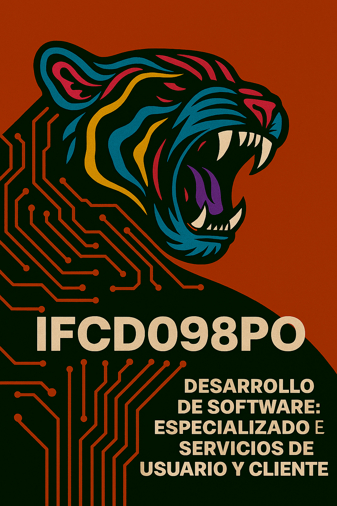

# IFCD098PO - Desarrollo de Software Especializado en Servicios de Usuario y Cliente

> 🏢 **Entidad organizadora:** Grupo Colón-IECM  
> 📍 **Ubicación:** Alcalá de Henares, Calle Linares 4  
> ⏳ **Duración:** 160 horas  
> 💸 **Costo:** Gratuito  
> 🎓 **Modalidad:** Presencial  
> 🔗 [Más información en la web oficial](https://grupocoloniecm.com/ifcd098po)

---

## 🚀 ¿Qué aprenderás?

Este curso está diseñado para que desarrolles software enfocado en mejorar la experiencia del usuario y la atención al cliente. Aprenderás a crear soluciones digitales eficientes, intuitivas y adaptadas a las necesidades reales del entorno profesional.

### 🧠 Competencias que adquirirás

- Diseño de interfaces centradas en el usuario
- Desarrollo de aplicaciones orientadas a servicios
- Integración de tecnologías modernas en entornos cliente-servidor
- Documentación técnica profesional con Markdown
- Trabajo colaborativo con herramientas como Git y GitHub

---

## 🛠️ Tecnologías y herramientas

- HTML, CSS, JavaScript
- APIs RESTful
- Control de versiones con Git
- Documentación técnica con Markdown 